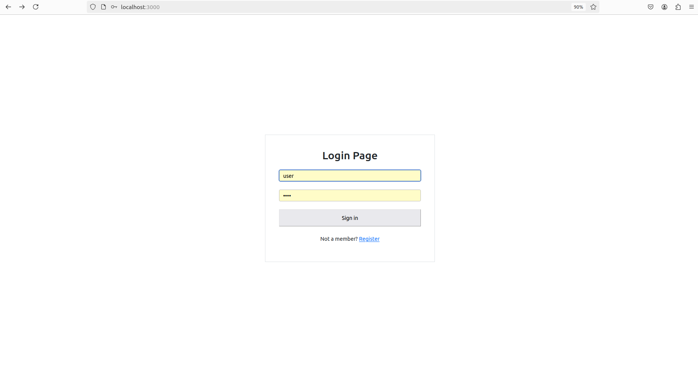
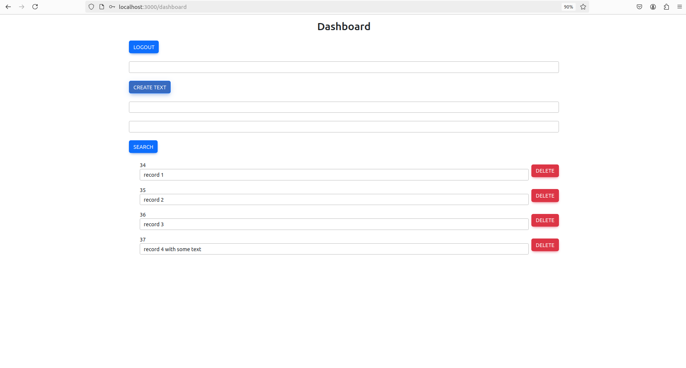
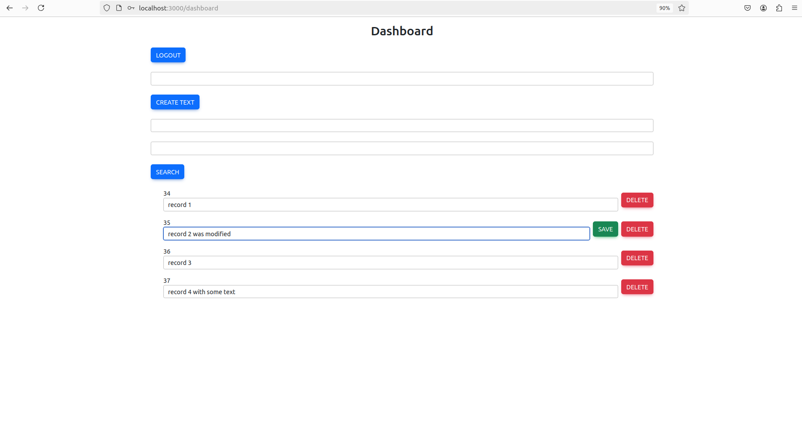
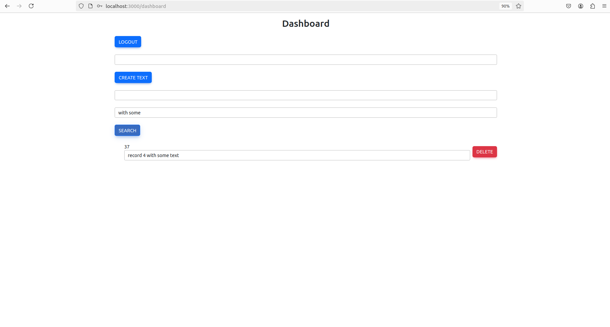
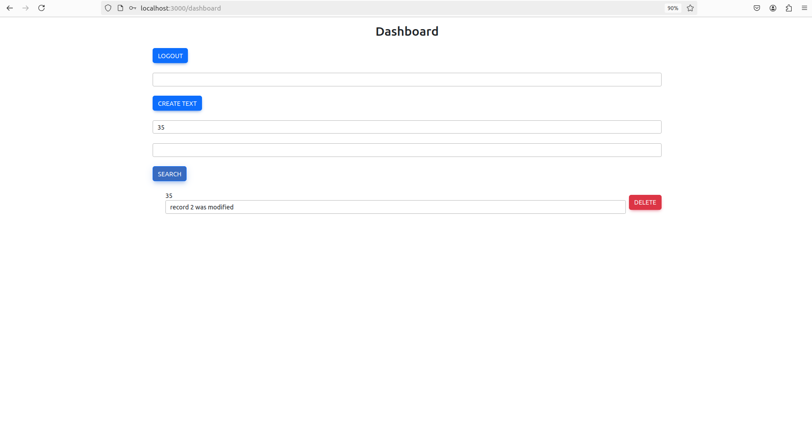

# Текстовая библиотека

## Описание

Это веб-приложение разработано с использованием Spring Boot и React. Оно позволяет пользователям регистрироваться, авторизовываться и управлять своими текстовыми записями. Приложение предоставляет возможность создавать, удалять, редактировать и искать текстовые записи.

## Функциональность

- Регистрация и авторизация пользователей.
- Создание текстовых записей.
- Удаление созданных текстовых записей.
- Редактирование текстовых записей.
- Поиск текстовых записей по ID и содержимому.
- Отображение полного списка созданных пользователем текстовых записей.

## Технические требования

### Backend
- Java 17
- Spring Boot
- Maven
- PostgreSQL (для хранения данных пользователей)
- MongoDB (для хранения текстовых записей)

### Frontend
- Node.js 18.x
- React

## Инструкция по развёртыванию

### 1. Подготовка окружения

#### Установите необходимые инструменты:

1. **Java 17**: Убедитесь, что Java 17 установлена на вашей машине.

2. **Maven**: Убедитесь, что Apache Maven установлен.

3. **PostgreSQL**: Установите PostgreSQL для хранения данных пользователей.

4. **MongoDB**: Установите MongoDB для хранения текстовых записей.

5. **Node.js и npm**: Установите Node.js версии 18 и выше.

### 2. Клонирование репозитория


1. Перед началом установки клонируйте репозиторий с исходным кодом приложения:

    ``` bash
    git clone https://github.com/krr006/Spring-boot-MongoDB.git
    cd Spring-boot-MongoDB

### 3. Настройка базы данных

#### PostgreSQL:

1. Запустите PostgreSQL и создайте новую базу данных и таблицы:

   ```sql
   CREATE DATABASE postgres;

   \c postgres;

   CREATE TABLE app_users (
       id SERIAL PRIMARY KEY,
       email VARCHAR(255) NOT NULL UNIQUE,
       password VARCHAR(255) NOT NULL,
       username VARCHAR(255) NOT NULL UNIQUE,
       role VARCHAR(50) NOT NULL
   );

2. Обновите настройки подключения в `application.yaml`:
    ```yaml
    spring:
      datasource:
        url: jdbc:postgresql://localhost:5432/postgres
        username: postgres
        password: password
        driver-class-name: org.postgresql.Driver

#### MongoDB:

1. Запустите MongoDB на порту по умолчанию (`27017`).
2. Обновите настройки подключения в `application.yaml`: 
    ```yaml
   spring:
      data:
         mongodb:
         host: localhost
         port: 27017
         database: text_record_db

### 4. Запуск бэкенда (Spring Boot)

1. Перейдите в директорию `project-test`:
    ```bash
   cd project-test

2. Соберите проект с помощью Maven:
    ```bash
    mvn clean package

3. Запустите Spring Boot приложение:
    ```bash
    mvn spring-boot:run

### 5. Запуск фронтенда (React)

1. Перейдите в директорию `sec-app`:
   ```bash
   cd sec-app

2. Установите зависимости:
    ```bash
    npm install

3. Запустите фронтенд-приложение:
    ```bash
    npm start

Фронтенд будет доступен по адресу `http://localhost:3000`.

## Обзор функциональности

1. При переходе по адресу `http://localhost:3000` будет предложено войти в систему или, если еще нет аккаунта, создать его, 
а после уже войти в систему с помощью `username` и `password`:


2. После входа откроется главная страница, где можно создавать, редактировать, удалять и выполнять поиск записей по 
их содержимому или уникальному номеру `id`:


3. Пример поиска редактирования записи:


4. Пример поиска по содержимому:


5. Пример поиска по `id` записи:



